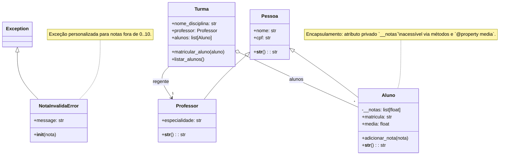

# Diagrama UML — Sistema Escolar (baseado em `main.py`)

Descrição: Diagrama de classes em Mermaid para o mini-sistema implementado em `main.py`.

**Resumo (texto):**
- `NotaInvalidaError` (herda de `Exception`) — exceção personalizada.
- `Pessoa` — classe base com `nome` e `cpf` e `__str__`.
- `Professor` — herda de `Pessoa`, adiciona `especialidade`.
- `Aluno` — herda de `Pessoa`, tem `matricula`, atributo privado `__notas`, método `adicionar_nota` (lança `NotaInvalidaError` se inválida) e propriedade `media`.
- `Turma` — associa um `Professor` (regente) e contém vários `Aluno` (agregação). Métodos: `matricular_aluno`, `listar_alunos`.

**Como visualizar:**
- No VS Code instale uma extensão de preview Mermaid (ex.: "Markdown Preview Mermaid Support") ou abra este arquivo em um renderer que suporte Mermaid/GitHub (GitHub rende mermaid em .md se habilitado).

Arquivo gerado: `POO/SistemaPoo/diagrama.md`
